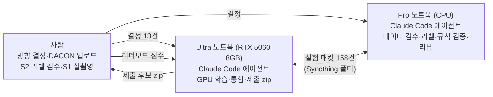

# 블랙박스 영상으로 사고를 분석하는 AI — DACON AFDA 챌린지 참가 기록

**AFDA = Accident Fraud Detection AI**

블랙박스 영상 한 편을 보고 다음 세 가지를 자동으로 알아내는 AI를 만들었습니다.

1. 영상이 원본인지, 모니터 화면을 다시 찍은 것인지
2. 상대 차가 언제 끼어들어 언제 부딪쳤는지, 어느 쪽에서 왔는지, 피할 공간이 있었는지
3. 내 차가 매 순간 가속·감속·정지 중이었는지, 왼쪽·오른쪽으로 돌고 있었는지

DACON의 [블랙박스 영상 기반 지능형 고의사고 분석 모델 AI 경진대회](https://www.dacon.io/competitions/official/236753/overview/description)에 참가하면서, 2026년 9월 23일부터 28일까지 약 6일 동안 진행했습니다.

작업은 노트북 두 대에서 **Claude Code 에이전트 두 개가 나눠 맡았습니다.** 사람은 방향을 정하고, 결과 파일을 DACON에 올리고, 일부 라벨링과 촬영을 했습니다. 공개 리더보드 종합 점수는 **0.382에서 0.471로** 올랐습니다.

이 문서는 대회가 끝난 뒤(9/29) 정리했습니다. 면접관이나 이 분야를 모르는 분도 읽을 수 있게 썼습니다.

- 시행착오를 날짜순으로 읽으려면 [docs/JOURNEY.md](docs/JOURNEY.md)를 보세요.
- Stage별 실험과 수치는 [docs/EXPERIMENTS.md](docs/EXPERIMENTS.md)에 있습니다.
- 에이전트 원본 기록은 [docs/records/](docs/records/)에 있습니다.

---

## 1. 무엇을 풀었나

### 배경

교통사고 감정관은 사고 영상을 여러 번 돌려 보며 다음을 수작업으로 확인합니다.

- 영상이 조작되지 않았는지
- 상대 차가 언제 끼어들었는지
- 차가 어떻게 움직였는지

고의 사고(보험 사기)를 가려낼 때 이 확인이 특히 중요합니다. 이 대회는 그 판단을 도울 정보를 영상만 보고 자동으로 뽑아 내는 모델을 요구했습니다. 모델의 출력은 판단을 돕는 단서일 뿐, 그 자체로 고의성을 판정하지는 않습니다.

### 세 가지 과제(Stage)

| Stage | 질문 | 모델이 내야 하는 답 | 채점 | 비중 |
|---|---|---|---|---|
| 1 | 원본 영상인가, 화면을 다시 찍은 영상인가? | ORIGINAL / RERECORDED | Macro-F1 | 20% |
| 2 | 충돌·끼어들기는 몇 번째 프레임인가? 어느 쪽에서 왔나? 피할 공간이 있었나? | 충돌 프레임, 진입 프레임, 진입 방향, 회피 공간 여부 | 시점 적중률 70%, 분류 30% | 40% |
| 3 | 내 차는 매 0.1초마다 어떤 상태였나? | 가속·감속·등속·정지, 좌회전·직진·우회전 | 가감속 70%, 조향 30% | 40% |

용어는 다음과 같습니다.

- **Macro-F1:** 클래스마다 맞힌 정도를 계산해 평균 낸 점수입니다. 한쪽 답만 계속 내면 0.5를 넘을 수 없습니다.
- **시점 적중률(Accuracy@0.3초):** 예측한 프레임이 정답과 0.3초 안에 들어온 비율입니다.

### 제출 방식

제출물은 예측 결과 파일이 아니라 **실행 코드와 모델 가중치를 담은 `submit.zip`** 입니다.

- DACON 서버가 인터넷이 끊긴 환경에서 비공개 영상으로 이 코드를 실행하고 채점합니다.
- 실행 시간은 60분으로 제한됩니다.
- 하루에 3번까지 제출할 수 있습니다.

---

## 2. 결과 한눈에 보기

공개 리더보드에 7번 제출했습니다. 종합 점수는 `0.2×S1 + 0.4×S2 + 0.4×S3`입니다.

| 제출 | 날짜 | S1 | S2 | S3 | 종합 | 실행 시간 | 무엇을 바꿨나 |
|---|---|---|---|---|---|---|---|
| v001 | 9/26 | 0.565 | 0.206 | 0.466 | 0.3816 | 15분 | 첫 완성본(세 Stage 모두 학습 모델) |
| v001b | 9/26 | 0.565 | 0.163 | 0.466 | 0.3643 | 14분 | S2 시점을 고정값으로 바꿈 → 하락, 폐기 |
| v002 | 9/27 | 0.565 | 0.206 | **0.589** | 0.4308 | 14분 | S3에 "정지" 판별 헤드 추가 |
| v002_s2rule | 9/27 | 0.565 | **0.306** | 0.589 | 0.4707 | 49분 | S2 시점을 움직임 규칙으로 바꿈 |
| probe1 | 9/28 | 0.497 | 0.304 | 0.590 | 0.4570 | 51분 | S1 새 모델, S2 회피 규칙, S3 조향 규칙 |
| probe2_fix | 9/28 | 0.565 | 0.306 | 0.589 | **0.4709** | **18분** | 떨어진 Stage 되돌림, 실행 시간 버그 수정 |
| s1e003 | 9/28 | 0.550 | 0.306 | 0.590 | 0.4681 | 18분 | S1 새 모델(실촬영 데이터 추가) |

- **가장 큰 개선 두 가지:**
  - S3에 "정지" 판별을 따로 붙였더니 S3가 +0.12 올랐습니다.
  - S2의 충돌 시점을 학습 모델 대신 "화면 움직임이 급변하는 순간"을 찾는 규칙으로 바꿨더니 S2가 +0.10 올랐습니다.
- **공개 리더보드 최고 점수는 0.4709입니다.** Stage별 최고 모델을 모은 조합(예상 0.4711)은 준비했지만 마감 전에 제출하지 못했습니다.
- **최종 순위는 비공개 리더보드로 정해집니다.** 이 문서를 쓴 시점에는 결과가 나오지 않았습니다.

---

## 3. 어떻게 일했나: AI 에이전트 둘과 사람 하나



### 에이전트 루프(`agent_bridge`)

각 노트북의 예약 작업이 Claude Code(`claude -p`)를 반복해서 실행합니다. 한 번 실행되는 단위를 **사이클**이라고 부릅니다.

- **사이클이 하는 일:**
  1. 상태 파일, 상대가 보낸 패킷, 끝난 학습 결과를 읽습니다.
  2. 지금 가장 가치 있는 일 하나를 합니다.
  3. 결과를 JSON 보고서로 남깁니다.
- **긴 작업:** 학습처럼 오래 걸리는 일은 작업 큐(job)에 넣습니다. GPU 작업은 한 번에 하나만 돌립니다. 작업이 끝나면 루프가 다음 사이클을 깨웁니다.
- **PC 간 대화:** 두 PC는 대화창이 아니라 **패킷**(요청·검증 결과·리뷰·결정 파일)으로 주고받습니다. 누가 무엇을 근거로 결정했는지 파일로 남습니다.
- **안전장치:**
  - 허용된 명령 목록과 guard 훅이 강제 push와 프로세스 강제 종료 같은 위험한 명령을 막습니다.
  - main 브랜치에는 Ultra만 push합니다.
  - 평가 데이터끼리의 통계로 예측을 보정하는 것은 규칙으로 금지했습니다.

### 사람이 한 일

- **방향 결정:** 에이전트가 스스로 정하기 어려운 방향을 13번 결정했습니다. 예를 들어 "같은 종류의 데이터를 더 모으지 말고 움직임 기반으로 바꾸자" 같은 것입니다. 결정문은 [CLAUDE.md](CLAUDE.md)에 있습니다.
- **DACON 업로드:** 에이전트는 업로드하지 않습니다.
- **S2 라벨 검수:** 사람이 직접 22건을 검수했습니다.
- **S1 실촬영:** 갤럭시 S23 Ultra로 모니터 화면을 직접 다시 찍었습니다.

### 규모

- Git 커밋 110여 개
- Ultra 에이전트 사이클 86회(API 요금으로 환산하면 약 $227)
- 학습·평가 작업 39개
- 자동 테스트 191개

---

## 4. 최종 모델은 이렇게 동작한다

`submission/inference.py` 하나가 세 Stage를 모두 처리합니다. DACON 서버에서 약 18분 걸렸습니다.

| Stage | 방식 | 한 줄 설명 |
|---|---|---|
| S1 재촬영 판별 | 학습 모델(MViTv2-S, e001) | 영상 16프레임을 보는 동영상 분류기입니다. 주행 영상을 "화면에 띄워 다시 찍은 것처럼" 가공한 합성 데이터로 학습했습니다. |
| S2 충돌·진입 시점 | **학습 없는 규칙** | 프레임을 160×90 흑백으로 줄이고, 프레임 사이 픽셀 이동(광학 흐름)을 계산합니다. 화면 전체 움직임이 가장 급하게 바뀐 순간을 충돌로 봅니다. 진입은 충돌 0.8초 전입니다. |
| S2 방향·회피 | 학습 모델(ResNet18 + 시계열) | 프레임별 이미지 특징을 이어 보는 작은 모델입니다. |
| S3 가감속·정지 | 학습 모델(MViTv2-S, e005) | 4가지 가감속 상태와 "정지 여부"를 따로 예측합니다. |
| S3 조향 | **학습 없는 규칙** | 먼 풍경이 좌우로 흐르는 방향(차가 도는 방향)으로 좌·직진·우를 정합니다. |

---

## 5. 시행착오와 배운 점

자세한 기록은 [docs/JOURNEY.md](docs/JOURNEY.md)에 있습니다. 여기서는 핵심만 추립니다.

### ① 우리 검증은 실제 평가를 대표하지 못했다

자체 검증에서 좋아진 후보가 리더보드에서는 좋아지지 않은 일이 반복됐습니다.

| 후보 | 자체 검증 | 리더보드 |
|---|---|---|
| S1 e001 | 공개 예제 10개를 모두 "재촬영"으로 예측 | 0.565로, 무작위 수준 이상 |
| S2 고정 시점 | 공개 예제에서 학습 모델보다 나음 | 0.206 → 0.163 |
| S1 e003 | 실제 재촬영 검증에서 AUROC 1.0(완벽한 구분) | 0.565 → 0.550 |
| S3 조향 규칙 | 조향 점수 0.32 → 0.72 | 조향 점수 약 +0.004 |

검증 방식 가운데 리더보드와 맞았던 것은 하나뿐이었습니다. **대회의 정답 정의(실제 충돌 순간)와 같은 정답으로 만든 S2 시점 검증**입니다. 이후에는 "평가와 같은 정의의 정답을 가진 검증"을 먼저 만드는 것을 원칙으로 삼았습니다.

### ② 화면을 외운 모델보다 움직임을 보는 규칙이 강했다

학습 데이터와 평가 영상은 성격이 전혀 달랐습니다.

- **평가 쪽:** 공식 예제는 2012년 무렵의 저화질 4:3 블랙박스 영상이고, 동유럽 도로로 보이며, 날짜 자막이 있습니다.
- **학습 쪽:** 미국 HD 블랙박스(Nexar)와 고속도로 주행 영상(comma2k19)이었습니다.

그 결과 화면 모양을 배운 모델은 평가 영상에서 힘을 잃었습니다. S3 가감속 모델은 학습 데이터에서 가속·감속 구분 AUROC가 0.98이었지만, 검증 데이터에서는 0.20이었습니다. 움직임이 아니라 장면을 외운 것입니다.

그래서 **"화면이 어떻게 생겼나"가 아니라 "화면이 어떻게 움직이나"를 보는 방식**으로 바꿨습니다(결정 12). 그중 S2 충돌 시점 규칙이 이 대회에서 가장 큰 개선(+0.10)을 냈습니다.

### ③ 실행 시간 50분의 원인을 추측이 아니라 비교로 찾았다

S2 규칙을 넣은 뒤 서버 실행 시간이 14분에서 49분으로 늘었습니다. 공식 한도 60분에 가까운 수준이었습니다.

- **처음 추정:** 처음에는 S3 움직임 계산을 의심해 그쪽만 빠르게 고쳤습니다.
- **실측 비교:** 제출별 실행 시간을 나란히 놓자 원인이 드러났습니다. v002는 14분, S2 규칙만 추가한 제출은 49분, 여기에 S3 규칙 등을 더 넣은 제출은 51분이었습니다.
- **진짜 원인:** S2 규칙이 영상 프레임을 원본 해상도로 **한 장씩 순서대로** 다시 읽고 있었습니다. 모델 쪽은 같은 프레임을 이미 6개 프로세스로 병렬로 읽고 있었습니다.
- **해결:** 결과가 비트 단위까지 같게 유지되도록 병렬 처리로 바꿨고, 실행 시간은 18분이 됐습니다. S2 점수가 소수점 끝자리까지 같게 나와, 결과가 바뀌지 않았음도 확인했습니다.

로컬 점검은 예제 영상 몇 개로만 돌아서 이 비용이 보이지 않았습니다.

### ④ 제출 기회가 적을 때는 한 번에 하나씩 바꾸고 되돌린다

제출은 하루 3번뿐이었습니다. 리더보드가 Stage별 점수를 따로 보여 주는 점을 이용했습니다.

- 한 번 제출할 때 **Stage마다 변경을 하나씩만** 넣었습니다.
- 점수가 떨어진 Stage는 다음 제출에서 이전 최고 모델로 되돌렸습니다.

이렇게 적은 제출로 여러 후보를 따로따로 판정할 수 있었습니다.

### ⑤ 코덱만 봐도 답이 보이는 지름길을 막았다

S1 공식 예제는 원본이 MPEG-4, 재촬영본이 H.264로 인코딩돼 있었습니다. 모델이 영상 내용 대신 코덱 차이만 배울 위험이 있었습니다. 그래서 합성 데이터의 절반 이상은 두 클래스를 같은 코덱과 비슷한 화질로 만들었습니다.

### ⑥ AI 에이전트를 운영하며 생긴 문제들

| 문제 | 해결 |
|---|---|
| 에이전트의 JSON 보고가 형식 오류로 실패함 | 대화 기록에서 마지막 보고를 복구하는 기능 추가 |
| 돌고 있던 사이클이 끝나면서 사람이 넣은 지시를 덮어씀 | 사이클이 끝난 뒤 다시 깨우는 감시 스크립트 사용 |
| GPU 드라이버가 멈춰(TDR) 학습 작업을 잃음 | 잃은 실험(S3 e003)은 다시 돌리지 않고 다음 후보로 넘어감 |
| Windows 앱 샌드박스가 파일 쓰기를 가상화함 | 스크립트를 파일 대신 표준 입력으로 실행 |
| GitHub CI가 한글 출력에서 cp1252 인코딩 오류를 냄 | 출력 인코딩을 UTF-8로 고정 |
| 사용량 한도와 이동 때문에 여러 번 멈춤 | 마지막 날 멈춘 사이에 00:00 제출 계획을 놓침 |

마지막 항목이 가장 아쉬웠습니다. 마감 직전 계획에는 사람이 자리를 비우는 경우도 미리 넣어야 합니다.

---

## 6. 저장소 안내

| 경로 | 내용 |
|---|---|
| `submission/inference.py` | 최종 제출 코드(세 Stage 추론) |
| `src/afda/` | 학습과 추론이 함께 쓰는 모듈. 대표적으로 `metrics.py`(공식 채점식), `s2_motion_rule.py`, `s3_yaw_steer.py` |
| `scripts/` | 데이터 확보, 합성 재촬영, 학습(`train_stage1/2/3.py`), 평가(`eval_*.py`), 종단 점검(`preflight_e2e.py`), 제출 zip 조립(`build_probe_zip.py`) |
| `configs/` | PC 역할과 실험 설정(`configs/exp/`) |
| `agent_bridge/` | 에이전트 루프, 패킷, 작업 큐 |
| `exchange_bridge/` | 두 PC 사이 Syncthing 교환 |
| `harness/` | 실행 기록, 출력 형식 검사, zip 검사 |
| `tests/` | 자동 테스트(GitHub Actions에서도 실행) |
| `CLAUDE.md` | 에이전트 운영 규칙과 사용자 결정 1~13 |
| `docs/JOURNEY.md` | 날짜순 시행착오 이야기 |
| `docs/EXPERIMENTS.md` | Stage별 실험·규칙 후보와 결과 |
| `docs/records/` | 에이전트 작업 로그, 두 PC 패킷 목록 |
| `docs/CLAUDE_OPERATION.md` | 에이전트 무인 운영 방법 |
| `docs/RESOURCE_LICENSES.md` | 외부 데이터·가중치 출처와 이용 조건 |

---

## 7. 직접 실행해 보기

대회 원본 데이터와 학습된 가중치는 저장소에 없습니다. 테스트는 데이터 없이도 돌아갑니다.

```powershell
git clone https://github.com/jinw00ch01/Dacon_AFDA_Challenge.git
cd Dacon_AFDA_Challenge
powershell -NoProfile -ExecutionPolicy Bypass -File scripts/bootstrap.ps1 -Role ultra5060
.\.venv-ultra5060\Scripts\python.exe -m unittest discover -s tests
```

전체 과정을 다시 하려면 다음 순서를 따릅니다.

1. **환경 준비:** Windows와 Python 3.12가 필요합니다. 학습에는 NVIDIA GPU(8GB)를 썼습니다. 설치는 `scripts/bootstrap.ps1`, 점검은 `scripts/check.ps1`로 합니다.
2. **데이터 확보:** 공개 데이터는 `scripts/fetch_comma_subset.py`, `scripts/fetch_nexar_subset.py`로 받습니다. 둘 다 고정 revision과 SHA-256을 기록합니다. 대회 Baseline 예제는 DACON에서 직접 받아 `Baseline/`에 둡니다.
3. **학습 데이터 만들기:**
   - S1 합성 재촬영: `scripts/s1_synth_recapture.py`, `scripts/s1_synth_digital.py`
   - S2 에이전트 라벨: `scripts/stage2_agent_label.py`
   - S3 10Hz 센서 정답: `scripts/prepare_comma_subset.py`
4. **학습:** `scripts/train_stage1.py`, `train_stage2.py`, `train_stage3.py`에 `configs/exp/`의 설정을 넣습니다.
5. **점검과 제출물:** `scripts/preflight_e2e.py`로 세 Stage를 오프라인에서 끝까지 실행해 봅니다. 제출 zip은 기존 zip의 `inference.py`나 가중치를 바꿔 끼우는 방식으로 만들었습니다(`scripts/build_probe_zip.py`, `harness package`).

두 PC 에이전트 운영을 재현하려면 [docs/CLAUDE_OPERATION.md](docs/CLAUDE_OPERATION.md)와 [docs/AUTO_EXCHANGE.md](docs/AUTO_EXCHANGE.md)를 보세요.

---

## 8. 데이터와 라이선스

- **포함하지 않은 것:** 대회 원본(Baseline 예제, 평가 데이터), 영상, 학습된 가중치, 개인 장치 정보는 저장소에 넣지 않았습니다.
- **사용한 외부 자원:**
  - [comma2k19](https://github.com/commaai/comma2k19)(MIT): S3 학습, S1 합성 재료
  - [Nexar Collision Prediction](https://huggingface.co/datasets/nexar-ai/nexar_collision_prediction)(Nexar Open Data License): S2 학습·검증
  - torchvision 사전학습 가중치: MViTv2-S Kinetics-400, ResNet18 ImageNet
- **직접 만든 자료:** 합성 재촬영 영상, S23 실촬영 영상, S2 라벨은 직접 만들었고 공개하지 않습니다.
- 출처와 조건은 [docs/RESOURCE_LICENSES.md](docs/RESOURCE_LICENSES.md)에 정리했습니다.
- 이 저장소 코드의 오픈소스 라이선스는 아직 정하지 않았습니다. 제3자 데이터와 가중치는 이 코드와 같은 라이선스로 재배포하지 않습니다.

---

## 9. 한계와 다음에 한다면

- **S1은 끝까지 0.565를 넘지 못했습니다.** 평가와 같은 성격(저화질 4:3 블랙박스)의 원본·재촬영 쌍이 없었기 때문입니다. 다음에는 공식 예제 형식을 흉내 낸 학습 데이터부터 만들겠습니다. 마지막 날 계획했던 e004가 이것입니다.
- **S2 방향·회피는 무작위 예측과 구분되지 않았습니다.** 라벨이 적었고(사람 검수 22건과 에이전트 라벨), 도메인 차이도 컸습니다.
- **S3 가감속을 움직임만으로 판별하는 신호는 약했습니다.** 자체 기준(에피소드 AUROC 신뢰구간)을 통과하지 못했습니다.
- **검증부터 설계해야 합니다.** 평가와 같은 정의의 정답을 가진 검증셋을 대회 초반에 만들었다면, 헛된 후보에 쓴 시간과 제출 기회를 줄일 수 있었습니다.
- **마감 운영에 대비해야 합니다.** 사람이 자리를 비워도 마지막 제출이 준비되도록 마감 전 계획을 세워야 합니다.
